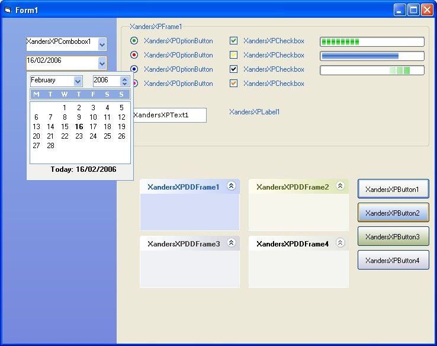



## Xanders XP Tools

### Description

I made these tools about 6 to 8 months ago... Never did get round to finishing them. Some are owner drawn and some just use existing MS tools.

The CheckBox and Option Button are fully colour customisable, and the command button comes with 4 colours. There is also a Taskbar control that allows a form to be placed hidden just off screen and a FormSkin control for creating forms in any shape you want with any picture.

Also has a Transparency Control, combobox, textbox, label, XP Frame and more...

As I said, I never got round to finishing this due to personal and work related issues. If you like this please vote!!!

Any bugs with any controls... then try and fix them yourself! I don't have the time nowadays!
 
### More Info
 

             |
---                |---
**Submitted On**   |2005-09-19 09:34:34
**By**             |[Xander75](https://github.com/Planet-Source-Code/PSCIndex/blob/master/ByAuthor/xander75.md)
**Level**          |Advanced
**User Rating**    |4.7 (99 globes from 21 users)
**Compatibility**  |VB 6\.0
**Category**       |[Custom Controls/ Forms/  Menus](https://github.com/Planet-Source-Code/PSCIndex/blob/master/ByCategory/custom-controls-forms-menus__1-4.md)
**World**          |[Visual Basic](https://github.com/Planet-Source-Code/PSCIndex/blob/master/ByWorld/visual-basic.md)
**Archive File**   |[Xanders\_XP1973602162006\.zip](https://github.com/Planet-Source-Code/xander75-xanders-xp-tools__1-64351/archive/master.zip)

